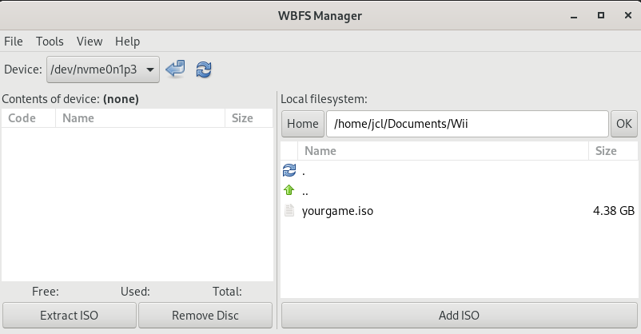

Hello there, I've just brushed off the dust from my old Nintendo Wii and saved a few of my Wii games onto a hard drive for a gaming. For that, today, we're going to dive into the world of WBFS and how you can use tools like [WBFS Manager](https://code.google.com/archive/p/linux-wbfs-manager/) and [Wiimms Tools (WIT)](https://wit.wiimm.de/) to manage your Wii games. Even though these tools are over a decade old, it's like they say, "Old is gold." 

## What is WBFS and Why Should I Care?

WBFS is short for Wii Backup File System developed for the Wii console. While not officially recognized by Windows, Linux, or Mac, there are fantastic tools like WBFS Manager and WIT that allow us to manage it with ease. Using WBFS Manager, you can change the format of your game backups, which are typically ISO files, into WBFS format and transfer them to your hard drive. Once there, these games can be loaded onto your Wii console through the Homebrew Channel.

### Installing WBFS Manager and Wiimms ISO Tools. 

Now, let's get to the fun part - installing WBFS Manager and Wiimms Tools on your [Fedora](https://src.fedoraproject.org/rpms/wbfs-manager) system. 

```bash
git clone https://github.com/jclaret/wii_tools.git
cd scripts
bash -x wii-tools.bash
```
Note that the script 'wii-tools.bash' will utilize the 'sudo' command to install WBFS Manager via dnf.

### Using WIT to Convert Files

WIT is a handy tool that allows you to convert files between WBFS and ISO formats. Here's how you can do it:

* To convert a WBFS file to ISO

```bash
wit copy yourgame.iso --wbfs yourgame.wbfs
```

To convert a WBFS to ISO:

```bash
wit copy yourgame.wbfs --iso yourgame.iso
```

### Using WBFS Manager to Transfer ISO Wii Games into Your WBFS Media

Open WBFS Manager. You can do this by typing **wbfs_gtk** in your terminal.

```bash
sudo wbfs_gtk
```
* Connect your WBFS media to your computer.

* In WBFS Manager, select your WBFS device from the dropdown menu.

* Navigate to the location of your Wii game ISO file and click on the 'Add to ISO' button to start the transfer.



And that's it! Your Wii game is now safely stored on your WBFS media.

Happy gaming!