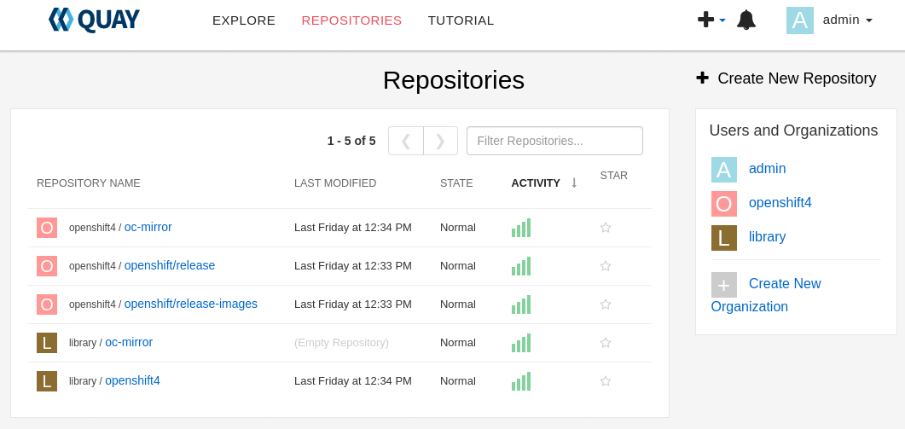

Let's kick things off by installing **Quay Registry** using the [mirror-registry](https://github.com/quay/mirror-registry), and mirroring an OpenShift release using the [oc-mirror](https://github.com/openshift/oc-mirror).

## Part 1: Setting Up Quay Registry with mirror-registry

### **Fetching the openshift tools repository**. 

Initiate by cloning the openshift tools repository with the following commands:

```bash
git clone https://github.com/jclaret/openshift_tools.git
cd openshift_tools/mirror-registry-install
```

### **Preparing Your Environment Variables**. 

Next, we need to properly establish our environment variables. The **install.sh** script handles the downloading of essential tools such as **mirror-registry**, **oc-mirror**, and **oc**, and takes care of the installation of the **Quay Registry**. Replace the environment variables with your own specific values:

```bash
export QUAY_HOSTNAME="your-registry:8443"
export QUAY_ROOT="/mirror/data"
export QUAY_USER="admin"
export QUAY_PASSWORD="changeme"
bash -x install.sh
```

The **install.sh** script initiates the **mirror-registry** installation process. It can take a while.

```bash
bash install.sh

   __   __
  /  \ /  \     ______   _    _     __   __   __
 / /\ / /\ \   /  __  \ | |  | |   /  \  \ \ / /
/ /  / /  \ \  | |  | | | |  | |  / /\ \  \   /
\ \  \ \  / /  | |__| | | |__| | / ____ \  | |
 \ \/ \ \/ /   \_  ___/  \____/ /_/    \_\ |_|
  \__/ \__/      \ \__
                  \___\ by Red Hat
 Build, Store, and Distribute your Containers
	
INFO[2023-05-09 22:38:08] Install has begun                            
DEBU[2023-05-09 22:38:08] Ansible Execution Environment Image: quay.io/quay/mirror-registry-ee:latest 
DEBU[2023-05-09 22:38:08] Pause Image: registry.access.redhat.com/ubi8/pause:8.7-6 
DEBU[2023-05-09 22:38:08] Quay Image: registry.redhat.io/quay/quay-rhel8:v3.8.6 
DEBU[2023-05-09 22:38:08] Redis Image: registry.redhat.io/rhel8/redis-6:1-92.1669834635 
DEBU[2023-05-09 22:38:08] Postgres Image: registry.redhat.io/rhel8/postgresql-10:1-203.1669834630 
INFO[2023-05-09 22:38:08] Found execution environment at /mirror/openshift_tools/mirror-registry-install/execution-environment.tar 
INFO[2023-05-09 22:38:08] Loading execution environment from execution-environment.tar 
DEBU[2023-05-09 22:38:08] Importing execution enviornment with command: /bin/bash -c /usr/bin/podman image import \
					--change 'ENV PATH=/usr/local/sbin:/usr/local/bin:/usr/sbin:/usr/bin:/sbin:/bin' \
					--change 'ENV HOME=/home/runner' \
					--change 'ENV container=oci' \
					--change 'ENTRYPOINT=["entrypoint"]' \
					--change 'WORKDIR=/runner' \
					--change 'EXPOSE=6379' \
					--change 'VOLUME=/runner' \
					--change 'CMD ["ansible-runner", "run", "/runner"]' \
					- quay.io/quay/mirror-registry-ee:latest < /mirror/openshift_tools/mirror-registry-install/execution-environment.tar 
Getting image source signatures
Copying blob 63bb300c167d skipped: already exists  
Copying config 05d84f2ff1 done  
Writing manifest to image destination
Storing signatures
sha256:05d84f2ff1c536ba131e73f23bcf7ca3c90ac14a144d1b1a3aa5b042f66d96d4
INFO[2023-05-09 22:38:17] Detected an installation to localhost        
INFO[2023-05-09 22:38:17] Found SSH key at /root/.ssh/quay_installer   
INFO[2023-05-09 22:38:17] Attempting to set SELinux rules on /root/.ssh/quay_installer 
chcon: can't apply partial context to unlabeled file '/root/.ssh/quay_installer'
WARN[2023-05-09 22:38:17] Could not set SELinux rule. If your system does not have SELinux enabled, you may ignore this. 
INFO[2023-05-09 22:38:17] Found image archive at /mirror/openshift_tools/mirror-registry-install/image-archive.tar 
INFO[2023-05-09 22:38:21] Detected an installation to localhost        
...

TASK [mirror_appliance : Create Quay Storage named volume] **********************************************************************************************************************************************************************************
ok: [root@registry]

TASK [mirror_appliance : Start Quay service] ************************************************************************************************************************************************************************************************
changed: [root@registry]

TASK [mirror_appliance : Wait for Quay] *****************************************************************************************************************************************************************************************************
included: /runner/project/roles/mirror_appliance/tasks/wait-for-quay.yaml for root@registry

TASK [mirror_appliance : Waiting up to 3 minutes for Quay to become alive at https://registry.lab:8443/health/instance] **********************************************************************************************************
FAILED - RETRYING: [root@registry]: Waiting up to 3 minutes for Quay to become alive at https://registry.lab:8443/health/instance (10 retries left).
FAILED - RETRYING: [root@registry]: Waiting up to 3 minutes for Quay to become alive at https://registry.lab:8443/health/instance (9 retries left).
ok: [root@registry]

TASK [mirror_appliance : Create init user] **************************************************************************************************************************************************************************************************
included: /runner/project/roles/mirror_appliance/tasks/create-init-user.yaml for root@registry

TASK [mirror_appliance : Creating init user at endpoint https://registry.lab:8443/api/v1/user/initialize] ************************************************************************************************************************
ok: [root@registry]

TASK [mirror_appliance : Enable lingering for systemd user processes] ***********************************************************************************************************************************************************************
skipping: [root@registry]

PLAY RECAP **********************************************************************************************************************************************************************************************************************************
root@registry              : ok=50   changed=30   unreachable=0    failed=0    skipped=17   rescued=0    ignored=0   

INFO[2023-05-09 22:40:35] Quay installed successfully, config data is stored in /mirror/data 
INFO[2023-05-09 22:40:35] Quay is available at https://registry.lab:8443 with credentials (admin, redhat00) 
mirror-registry completed without errors

```

Once this process is successfully completed and receiving the "mirror-registry completed without errors" message from the preceding command, Quay will be accessible at **https://registry.lab:8443**, log in using your own credentials.

### **Accessing Your Quay Registry**

Now that the Quay Registry is set up, it's time to log in and start exploring. You can choose to log in with or without verifying the TLS (Transport Layer Security) certificate.

#### Logging into the Registry without TLS Verification. 

If you want to bypass TLS verification for now, you can use the following command:

```bash
podman login -u $QUAY_USER -p $QUAY_PASSWORD $QUAY_HOSTNAME --tls-verify=false
```

#### Logging into the Registry with TLS Verification. 

If you prefer a more secure approach, you can add the registry's certificate to your trusted certificates. Here's how you do it:

First, extract the certificate from your registry:

```bash
echo "" | openssl s_client -showcerts -prexit -connect "$QUAY_HOSTNAME" 2> /dev/null | sed -n -e '/BEGIN CERTIFICATE/,/END CERTIFICATE/ p' > quay.cert
```

Then, copy the extracted certificate and update your system's trusted certificates directory:

```bash
cp quay.cert /etc/pki/ca-trust/source/anchors/
update-ca-trust
```

Finally, log into your registry with TLS verification:

```bash
podman login -u $QUAY_USER -p $QUAY_PASSWORD $QUAY_HOSTNAME
```

And voila! You're logged into your Quay Registry, ready to start managing your container images securely. Enjoy exploring your new registry!

## Part 2: Mirroring an OpenShift Release using oc-mirror

Now, let's dive into the second part of our journey: mirroring an OpenShift release

### Retrieving the Pull Secret from Red Hat OpenShift Cluster Manager.

Access the [Red Hat OpenShift Cluster Manager](https://console.redhat.com/openshift/install/pull-secret) to obtain your **registry.redhat.io** pull secret and save it as a **pull-secret.json** file. It is a necessary step for retrieving the OpenShift release.

### Mirror Openshift release.

We need to execute a script **mirror-release.sh** that automates the creation of an ImageSet, the mirroring process, and the preparation of the credentials file. Then, simply run the **mirror-release.sh** script:

```bash 
bash -x mirror-release.sh
```

This process may require some time
```bash 
bash -x mirror-release.sh
...
sha256:db976910d909373b1136261a5479ed18ec08c93971285ff760ce75c6217d3943 registry.lab:8443/openshift4/openshift/release-images:4.12.10-x86_64
sha256:96bf74ce789ccb22391deea98e0c5050c41b67cc17defbb38089d32226dba0b8 registry.lab:8443/openshift4/openshift/release-images:4.12.9-x86_64
info: Mirroring completed in 59m11.28s (9.074MB/s)
Writing image mapping to oc-mirror-workspace/results-1683716526/mapping.txt
Writing ICSP manifests to oc-mirror-workspace/results-1683716526

+ echo 'Mirroring process completed successfully.'
Mirroring process completed successfully.
```

This script performs several actions:

* **ImageSet Creation**: It generates an ImageSet with the specified minimum and maximum Openshift versions, in this demonstration, we've set the minVersion to 4.12.9 and the maxVersion to 4.12.10, but adjust these parameters according to your requirements. The ImageSet configuration is stored in a file named **imageset-config.yaml**.

* **Mirroring the OpenShift Release**: The script proceeds to mirror the OpenShift release using the **oc-mirror** command. This process might take some time due to the size of the OpenShift release.

* **Preparing the Credentials File**: Finally, the script creates an **auth.json** authentication file with your credentials encoded in base64 format. This file is subsequently merged with **pull-secret.json** and the output is directed to Docker's config.json file to let pull data from registries.

### **Extracting openshift-install**

With the mirroring process completed, it's time to extract **openshift-install** binary which will be useful to deploy an Openshift cluster.

* From an environment that has internet connectivity

```bash
digest=$(./oc adm release info -a auth.json $QUAY_HOSTNAME/openshift4/openshift/release-images:4.12.10-x86_64 -o jsonpath='{.digest}')
oc adm release extract -a auth.json --command=openshift-install "$QUAY_HOSTNAME/openshift4/openshift/release-images@${digest}"
```

```bash
openshift-install version
...
openshift-install 4.12.10
built from commit 5ba9890f636459b49a927a3bcb35a81929a0fc73
release image registry.lab:8443/openshift4/openshift/release-images@sha256:db976910d909373b1136261a5479ed18ec08c93971285ff760ce75c6217d3943
release architecture amd64
```

* From an environment with no internet connectivity (**--icsp-file**)

```bash
digest=$(./oc adm release info -a auth.json $QUAY_HOSTNAME/openshift4/openshift/release-images:4.12.10-x86_64 -o jsonpath='{.digest}')
oc adm release extract -a auth.json --icsp-file=oc-mirror-workspace/results-1683716526/imageContentSourcePolicy.yaml --command=openshift-install "$QUAY_HOSTNAME/openshift4/openshift/release-images@${digest}"
```

```bash
openshift-install version
...
openshift-install 4.12.9
built from commit 15d8ffe8fa3a5ab2f36f7e0a54126c98733aaf25
release image your-registry:8443/openshift4/openshift/release-images@sha256:96bf74ce789ccb22391deea98e0c5050c41b67cc17defbb38089d32226dba0b8
release architecture amd64
```


:(far fa-bookmark fa-fw): Note that **oc** command will typically attempt to download the binary file always from the internet. If you encounter any issues, you can gain more insight by running the **oc** command with the **--loglevel 8** flag for detailed logging


### **Quay repositories**

Log in into Quay using your credentials at **https://registry.lab:8443** , you will be able to see the repositories created during the mirroring process. 



Alternatively, as an optional step, you can use the curl command to view Quay repositories.

```bash
# https://$QUAY_HOSTNAME/organization/your_namespace_on_quay?tab=applications
export ACCESS_TOKEN=XXXXX

curl -k -X GET -H "Authorization: Bearer XXXXX" "https://$QUAY_HOSTNAME/api/v1/repository?namespace=openshift4"  | jq -r '.repositories[].name' | sort
...
oc-mirror
openshift/release
openshift/release-images
```

And just like that, you've installed Quay Registry and mirrored an OpenShift release! 

In upcoming posts, we'll walk you through the process of installing an OpenShift cluster using this registry. Be sure to keep an eye out for those!